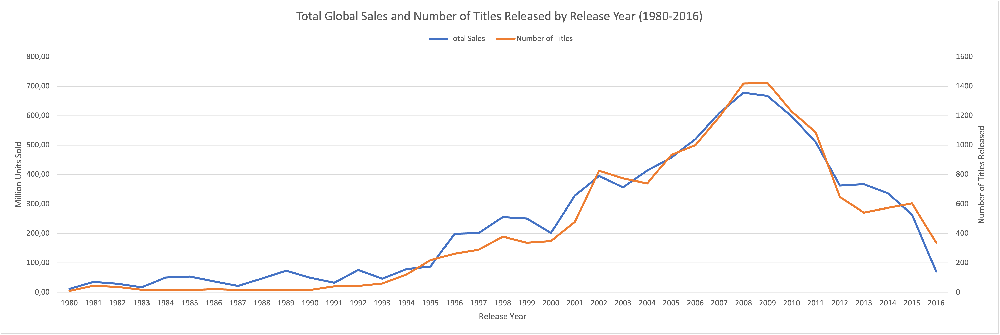
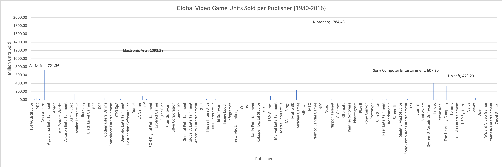
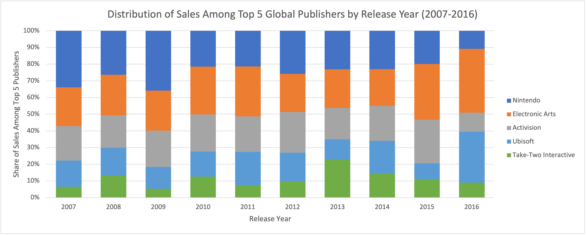
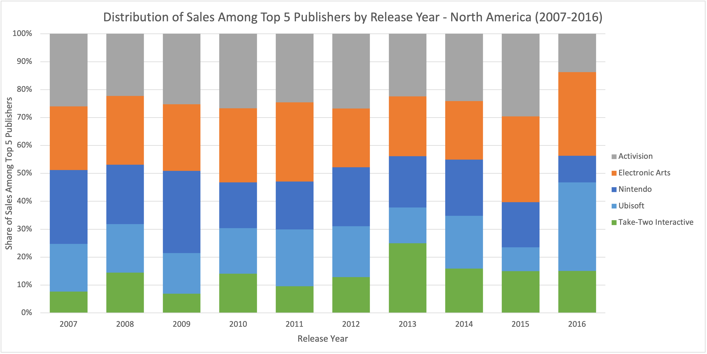
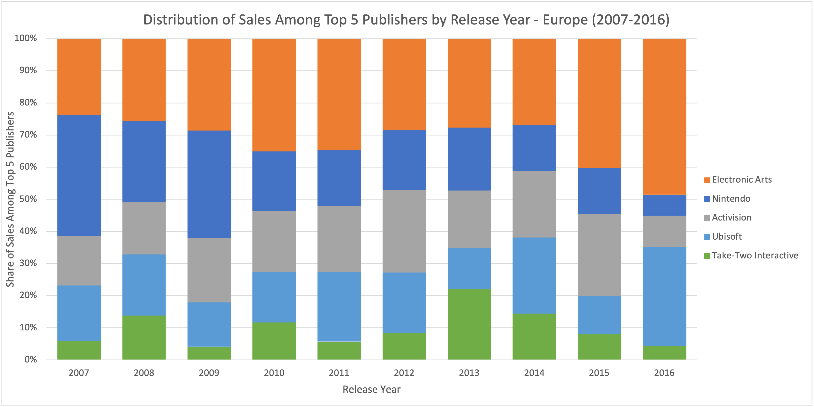
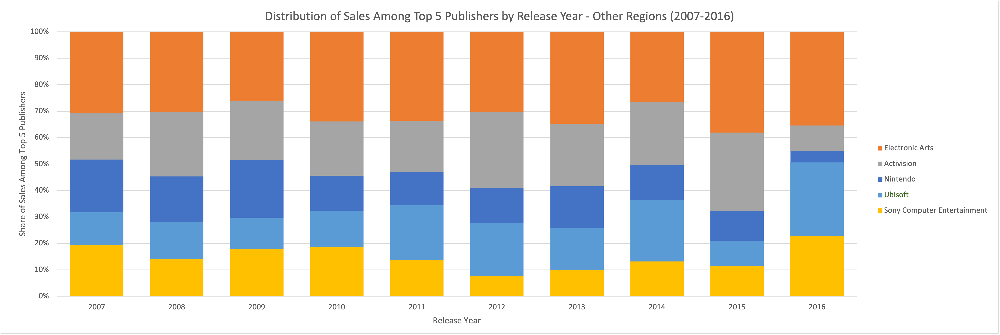

# Video Game Market Analysis
*This project was completed as part of the [CareerFoundry Data Analytics Program](https://careerfoundry.com/en/courses/become-a-data-analyst/).*

## Overview
A video game company’s board is preparing its 2017 marketing budget based on the assumption that regional sales trends and market shares have remained stable over time. This analysis challenges that assumption by examining how genre preferences, sales performance, and publisher dynamics have changed — and whether these patterns differ across regions.

## Tools
- **Excel** - Data Preparation | Visualisation | Analysis
- **KeyNote** - Presentation

## Process
- Data Description | Profiling | Exploration | Cleaning
- Descriptive Statistics | Trend Analysis
- Deriving Insights | Visualisation | Presentation

## Data
The original dataset was sourced from **VGChartz** that covers the period 1980 to 2020. A modified version was provided by **CareerFoundry** as part of their Data Analytics Course. 

- [**Video Game Sales**](https://coach-courses-us.s3.amazonaws.com/public/courses/intro-to-data/E4/vgsales_dirty.xlsx) - Number of units sold by title, release year, platform, genre, publisher, region.

***Note:** Sales figures prior to 2018 are based on extrapolated retail data and include estimates for digital sales. This introduces potential sampling and estimation biases, meaning figures may not fully represent actual market totals or digital performance.*

## Links
- [**Presentation**](https://github.com/davidgriesel/01-video-game-market-analysis/tree/main/deliverables/presentation.pdf)
- [**Presentation**](https://github.com/davidgriesel/01-video-game-market-analysis/blob/main/deliverables/presentation-with-notes.pdf) - Including presenters notes.

## Key Questions
1. Are certain types of games more popular than others?
2. What publishers dominate specific markets or regions?
3. Have any games or genres increased or decreased in popularity over time?
4. Have regional sales trends shifted, or do they remain consistent?

## Key Insights
### 1. Changing Dynamics in Distribution

<table>
<tr>
<td align="center" valign="top" width="100%">
     
    <em>Sales and title output rose steadily from the mid-1990s, peaking around 2008, before declining sharply. The downward trend coincides with the rise of digital platforms, suggesting a shift in market dynamics rather than an actual contraction, and confirms potential estimation bias in the dataset.</em>
</td>
</tr>
</table>
 

### 2. 

<table>
<tr>
<td align="center" valign="top" width="50%">
     
    <em>Insert caption here.*/em>
</td>
<td align="center" valign="top" width="50%">
     
    <em>Insert caption here.*/em>
</td>
</tr>
</table>
 

### 3. 

<table>
<tr>
<td align="center" valign="top" width="50%">
     
</td>
<td align="center" valign="top" width="50%">
     
</td>
</tr>

<tr>
<td colspan="2" align="center">
    <em>Caption describing both images above.</em>
</td>
</tr>

<tr>
<td align="center" valign="top" width="50%">
     
</td>
<td align="center" valign="top" width="50%">
     
</td>
</tr>

<tr>
<td colspan="2" align="center">
    <em>Caption describing both images above.</em>
</td>
</tr>
</table>
 
        
### 4. Sales Dominated by a Few Major Publishers

<table>
<tr>
<td align="center" valign="top" width="100%">
     
    <em>A small number of publishers dominate the global market, with Nintendo leading at approximately 1,786.6 million units, followed by EA (1,110.3M) and Activision (727.5M).</em>
</td>
</tr>
</table>
 

### 5. 

<table>
<tr>
<td align="center" valign="top" width="50%">
     
</td>
<td align="center" valign="top" width="50%">
     
</td>
</tr>
<tr>
<td align="center" valign="top" width="50%">
     
</td>
<td align="center" valign="top" width="50%">
     
</td>
</tr>
<tr>
<td colspan="2" align="center">
    <em>Caption describing both images above.</em>
</td>
</tr>
</table>
 
        

## Key Recommendations

## Takeaways
### Successes
The project met its core objectives by revealing actionable insights into genre preferences, regional shifts, and publisher dynamics. It clarified executive questions and challenged assumptions about market consistency, while confirming the industry’s shift from physical to digital formats.

### Challenges
Managing scope was a key challenge. With many interesting patterns in the data, it was easy to stray from the brief. Balancing depth with executive relevance required restraint, and the tendency to over-communicate insights highlighted the importance of concise messaging.

### Way Forward
Future efforts should stay closely aligned with stakeholder goals before exploring adjacent questions. Executive materials should favour clarity—brief bullets on slides, with detailed context reserved for presenter notes.
A regional breakdown of total sales volume would enhance the overall analysis and strengthen the response to Question 4 by clarifying when and where demand shifted toward digital formats.
Next steps could include sourcing digital sales data to compare trends with historical physical sales.
