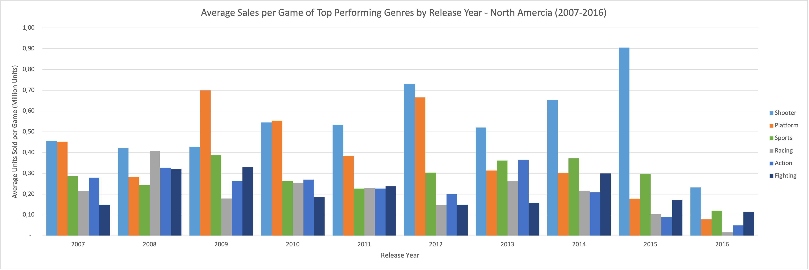
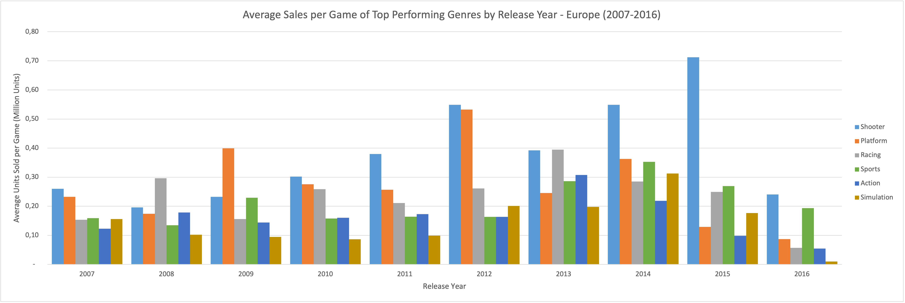
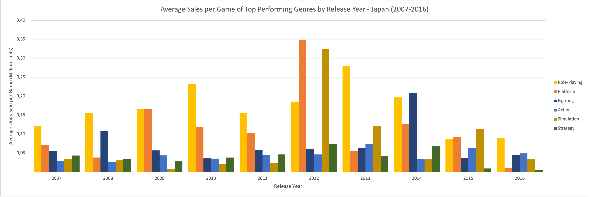
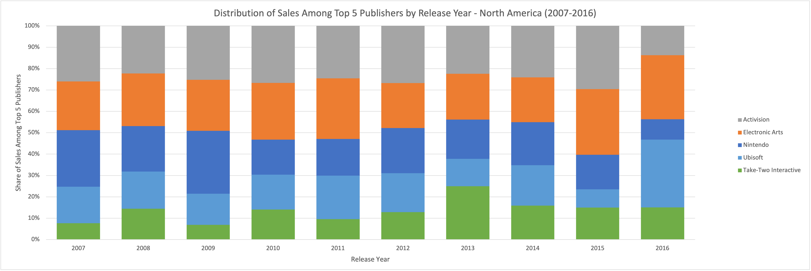
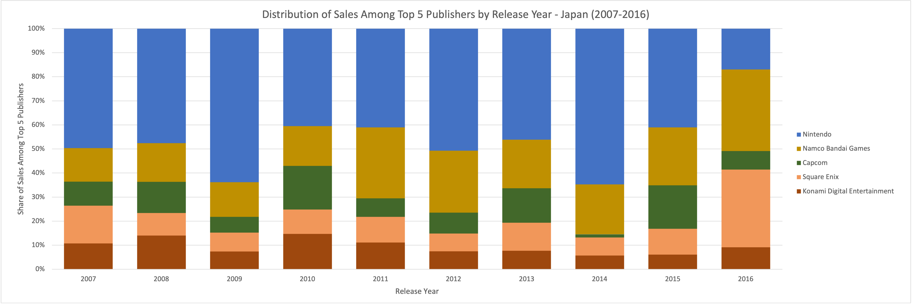

# Video Game Market Analysis
*This project was completed as part of the [CareerFoundry Data Analytics Programme](https://careerfoundry.com/en/courses/become-a-data-analyst/).*

## Overview
A video game company’s board is preparing its 2017 marketing budget based on the assumption that regional sales trends and market shares have remained stable over time. This analysis challenges that assumption by examining if genre preferences, sales performance, and publisher dynamics have changed, and whether trends differ across regions.
  

## Tools
- **Excel** - Data Preparation | Visualisation | Analysis
- **KeyNote** - Presentation
  

## Process
- **Data Preparation** - Data Description | Profiling | Exploration | Cleaning
- **Analysis** - Descriptive Statistics | Trend Analysis
- **Communication** - Visualisation | Presentation
  

## Data
The original dataset was sourced from VGChartz, covering the period 1980 to 2020. A modified version was provided by CareerFoundry as part of their Data Analytics programme. 

- [**Video Game Sales**](https://coach-courses-us.s3.amazonaws.com/public/courses/intro-to-data/E4/vgsales_dirty.xlsx) - Number of units sold by title, release year, platform, genre, publisher, region.

***Note:** Sales figures prior to 2018 are based on extrapolated retail data and estimated digital sales. This introduces potential sampling and estimation biases, meaning figures may not fully represent actual market totals or digital performance.*
  

## Links
- [**Presentation**](deliverables/presentation.pdf)
- [**Presentation**](deliverables/presentation_with_notes.pdf) - including presenter's notes.
  

## Key Insights
### 1. Market Expansion and Decline
Market contraction due to estimation bias during digital transition.
<table>
<tr>
<td align="center" valign="top" width="100%">
     
    <em>Sales and title output rose steadily until 2008, then declined sharply amid the rise of digital platforms, reflecting a structural market shift and estimation bias in the dataset.
</em>
</td>
</tr>
</table>
 

### 2. Regional Market Share
Europe emerged as the dominant regional market.
<table>
<tr>
<td align="center" valign="top" width="100%">
     
    <em>Europe gradually gained ground and overtook North America in 2016, marking a significant shift in regional market share, though likely influenced by the transition to digital distribution.</em>
</td>
</tr>
</table>
 

### 3. Regional Market Share by Genre
Action declined globally but gained popularity in Japan.
<table width="100%">
<tr>
<td align="center" valign="top" width="50%">
     
</td>
<td align="center" valign="top" width="50%">
     
</td>
</tr>
<tr>
<td align="center" valign="top" width="50%">
     
</td>
<td align="center" valign="top" width="50%">
     
</td>
</tr>
<tr>
</table>

<table>
<tr>
<td align="center" valign="top" width="100%">
    <em>Shooter overtook Action in North America, while Shooter and Sports surpassed it in Europe and Other, reflecting evolving platform trends and player preferences. Japan diverged, with Role-Playing dominant until Action rose late in the period.</em>
</td>
</tr>
</table>
 

### 4. Regional Genre Efficiency
Regional return on investment changed over time.
<table width="100%">
<tr>
<td align="center" valign="top" width="50%">
     
</td>
<td align="center" valign="top" width="50%">
     
</td>
</tr>
<tr>
<td align="center" valign="top" width="50%">
     
</td>
<td align="center" valign="top" width="50%">
     
</td>
</tr>
<tr>
</table>

<table>
<tr>
<td align="center" valign="top" width="100%">
    <em>Genre efficiency shifted alongside sales trends, with Shooter overtaking Platform to become the strongest performer in all regions except Japan, where Role-Playing remained dominant. Action posted only moderate average returns despite high total sales volumes.</em>
</td>
</tr>
</table>
 

### 5. Global Competition
A few major publishers dominated the global competitive landscape.
<table>
<tr>
<td align="center" valign="top" width="100%">
     
    <em>Global video game sales are dominated by a few major publishers, with Nintendo leading at nearly 1.8 billion units, followed by EA and Activision with significantly lower totals. In contrast, the vast majority of publishers account for only a tiny fraction of total sales.</em>
</td>
</tr>
</table>
 

### 6. Regional Competition
Publisher dominance evolved globally but took a distinct path in Japan.
<table width="100%">
<tr>
<td align="center" valign="top" width="50%">
     
</td>
<td align="center" valign="top" width="50%">
     
</td>
</tr>
<tr>
<td align="center" valign="top" width="50%">
     
</td>
<td align="center" valign="top" width="50%">
     
</td>
</tr>
<tr>
</table>

<table>
<tr>
<td align="center" valign="top" width="100%">
    <em>EA maintained dominance in Europe and Other, while Ubisoft surged late to top Activision in North America. Nintendo declined everywhere, and ceded leadership to Namco Bandai and Square Enix in Japan</em>
</td>
</tr>
</table>
 

## Takeaways
### Successes
The project met its core objectives by revealing actionable insights into genre preferences, regional shifts in sales, and publisher dynamics. It clarified executive questions and challenged assumptions about market consistency, while revealing the industry’s shift from physical to digital formats.

### Challenges
Managing scope was a key challenge. It was tempting to pursue additional lines of analysis, for example around per-title performance. Staying focused on the core objectives required discipline, prioritisation, and restraint. The experience reinforced the importance of addressing stakeholder questions first, before exploring adjacent insights.

### Way Forward
Future projects should begin with a more structured plan — outlining key questions, priorities, and intended deliverables — to maintain focus, prevent scope drift, and ensure that insights remain tightly aligned with project objectives.
